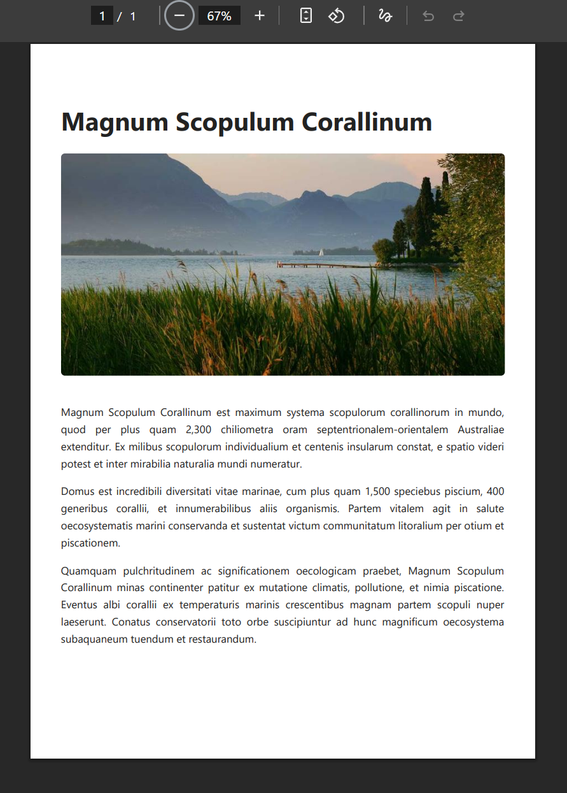
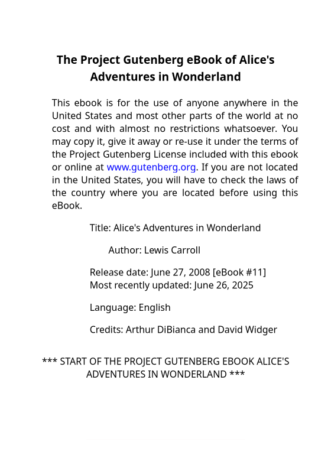
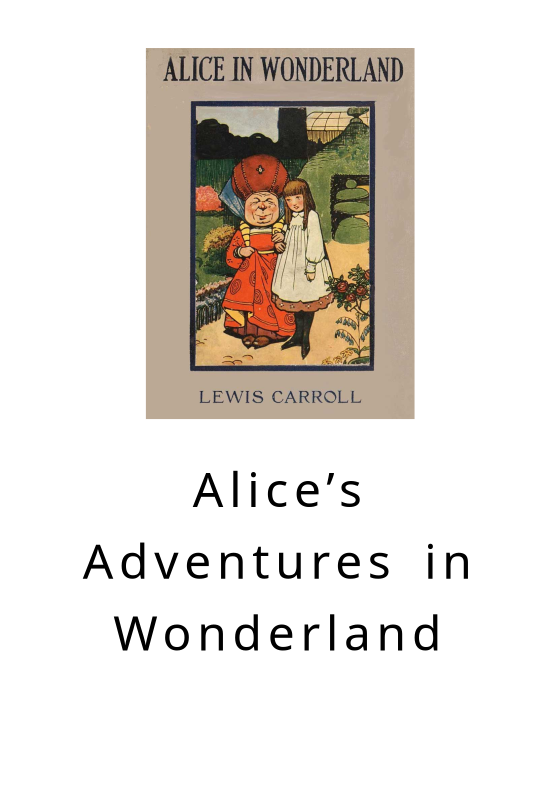
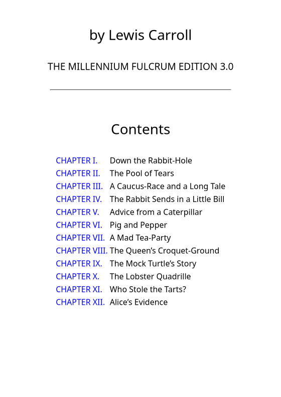
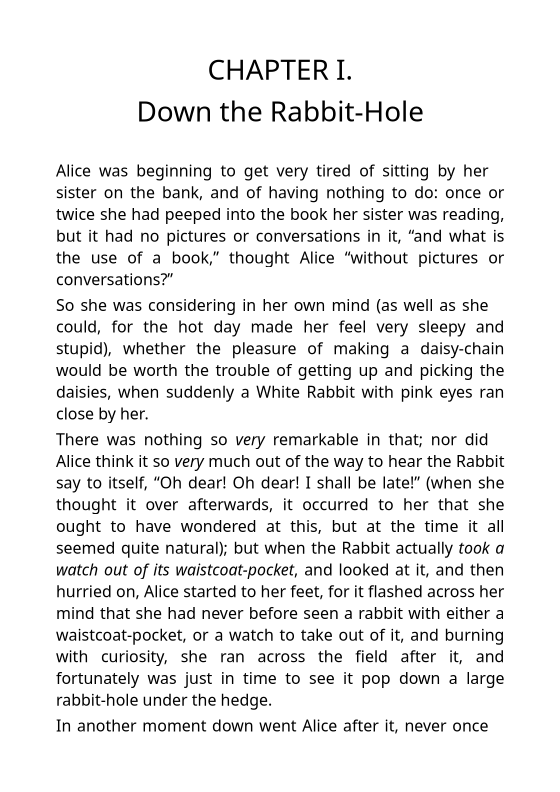
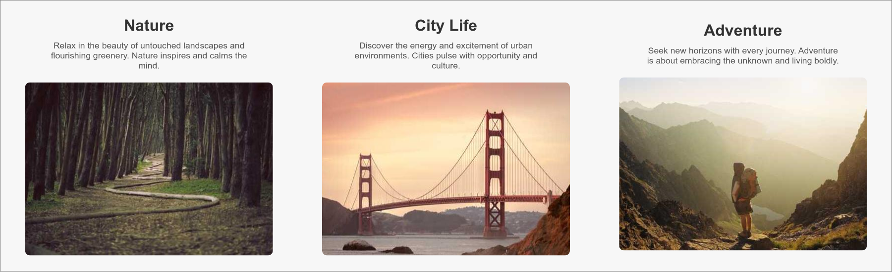

```@meta
CurrentModule = PlutoBook
```

# PlutoBook.jl

A Julia wrapper for the [PlutoBook](https://github.com/plutoprint/plutobook) C++ library - a robust HTML rendering engine for paged media that converts HTML/XML content to PDF documents and bitmap images.  Much of this documentation is copied from PlutoBook's own documentation. 

## Overview

PlutoBook.jl provides a Julia interface to the PlutoBook C++ library, which features:

- **Custom rendering engine**: Built from the ground up (not based on Chromium, WebKit, or Gecko)
- **Modern web standards**: Full support for CSS 3/4, HTML5, XHTML, and SVG
- **Multiple output formats**: Render to PDF or bitmap images (PNG)
- **Flexible page control**: Render individual pages or entire documents
- **Custom page sizes and margins**: Support for standard paper sizes (A4, Letter, etc.) and custom dimensions
- **Media type support**: Handle both print and screen media types
- **Image format support**: JPEG, PNG, WEBP, GIF, BMP, TGA
- **Memory efficient**: Optimized for performance with minimal memory footprint

A detailed list of features supported the current version of the underlying library can be seen on the [PlutoBook Features](https://github.com/plutoprint/plutobook/blob/main/FEATURES.md) page.

## Installation

```julia
using Pkg
Pkg.add("PlutoBook")
```
A [prebuilt binary](https://github.com/JuliaBinaryWrappers/PlutoBook_jll.jl) of the PlutoBook C++ library is installed automatically.

## Basic Usage

### Simple PDF Generation

```julia
using PlutoBook

# HTML content to render
html_content = """
<!DOCTYPE html>
<html lang=\"la\">
<head>
<meta charset=\"UTF-8\">
<title>Magnum Scopulum Corallinum</title>
<style>
    body { font-family: \"Segoe UI\", sans-serif; line-height: 1.6; margin: 40px auto; max-width: 800px; color: #222; }
    h1 { font-size: 2.5em; margin-bottom: 20px; }
    img { width: 100%; border-radius: 6px; margin-bottom: 20px; }
    p { font-size: 1.05em; text-align: justify; }
</style>
</head>
<body>
<h1>Magnum Scopulum Corallinum</h1>

<p>Magnum Scopulum Corallinum est maximum systema scopulorum corallinorum in mundo, quod per plus quam 2,300 chiliometra oram septentrionalem-orientalem Australiae extenditur. Ex milibus scopulorum individualium et centenis insularum constat, e spatio videri potest et inter mirabilia naturalia mundi numeratur.</p>
<p>Domus est incredibili diversitati vitae marinae, cum plus quam 1,500 speciebus piscium, 400 generibus corallii, et innumerabilibus aliis organismis. Partem vitalem agit in salute oecosystematis marini conservanda et sustentat victum communitatum litoralium per otium et piscationem.</p>
<p>Quamquam pulchritudinem ac significationem oecologicam praebet, Magnum Scopulum Corallinum minas continenter patitur ex mutatione climatis, pollutione, et nimia piscatione. Eventus albi corallii ex temperaturis marinis crescentibus magnam partem scopuli nuper laeserunt. Conatus conservatorii toto orbe suscipiuntur ad hunc magnificum oecosystema subaquaneum tuendum et restaurandum.</p>
</body>
</html>
"""

# Create a PlutoBook instance
book = plutobook_create(
    PLUTOBOOK_PAGE_SIZE_A4,           # A4 page size
    PLUTOBOOK_PAGE_MARGINS_NORMAL,    # Normal margins (72pt)
    PLUTOBOOK_MEDIA_TYPE_PRINT        # Print media type
)

# Load HTML content
plutobook_load_html(book, html_content, -1, "", "", "")

# Export to PDF
plutobook_write_to_pdf(book, "output.pdf")

# Clean up
plutobook_destroy(book)
```

Example output:

```@raw html 

```

---

### Page Rendering

PlutoBook supports precise page-level rendering, allowing individual pages to be drawn onto different canvas types, including bitmap canvases and PDF outputs. 

This example loads [**Alice’s Adventures in Wonderland**](https://www.gutenberg.org/ebooks/11) from Project Gutenberg, renders the first four pages as PNG images, and also exports them as a PDF.


```julia
using PlutoBook

# Create book instance
book = plutobook_create(
    PLUTOBOOK_PAGE_SIZE_A4,
    PLUTOBOOK_PAGE_MARGINS_NARROW,
    PLUTOBOOK_MEDIA_TYPE_PRINT
)

# Load HTML from file
plutobook_load_url(book, "Explore.html", "", "")

# Get page dimensions
page_size = plutobook_get_page_size(book)
page_width = ceil(page_size.width / PLUTOBOOK_UNITS_PX)
page_height = ceil(page_size.height / PLUTOBOOK_UNITS_PX)

# Create image canvas
canvas = plutobook_image_canvas_create(
    page_width,
    page_height,
    PLUTOBOOK_IMAGE_FORMAT_ARGB32
)

# Render each page
page_count = plutobook_get_page_count(book)
for page_index in 0:(page_count-1)
    # Clear canvas to white
    plutobook_canvas_clear_surface(canvas, 1, 1, 1, 1)
    
    # Render page
    plutobook_render_page(book, canvas, page_index)
    
    # Save as PNG
    plutobook_image_canvas_write_to_png(canvas, "page_$(page_index+1).png")
end

# Clean up
plutobook_canvas_destroy(canvas)
plutobook_destroy(book)
```

This code produces the following images:

| `page-1.png` | `page-2.png` | `page-3.png` |`page-4.png` |
| --- | --- | --- | --- |
|  |  |  |  |

---

### Document Rendering

PlutoBook supports full-document rendering, drawing the entire content flow as a single continuous layout. 

The example below demonstrates how to perform a full-document render of an HTML file into a bitmap image. The document's actual rendered dimensions are measured first, and then a canvas of that size is created to ensure the entire layout is captured without clipping. Finally, the rendered result is saved as a PNG image.


```@raw html
<details closed><summary>Explore.html</summary>
```
```html
<!DOCTYPE html>
<html lang="en">
<head>
  <meta charset="UTF-8">
  <title>Explore Life Through Moments</title>
  <style>
    body {
      display: flex;
      background: #f7f7f7;
      font-family: Arial, sans-serif;
      margin: 0;
    }

    .section {
      flex: 1;
      display: flex;
      flex-direction: column;
      align-items: center;
      justify-content: center;
      padding: 32px;
    }

    .section h2 {
      margin: 0 0 12px;
      font-size: 2rem;
      color: #333;
    }

    .section p {
      margin: 0 0 24px;
      font-size: 1.1rem;
      color: #555;
      text-align: center;
      max-width: 400px;
    }

    .section img {
      max-width: 100%;
      max-height: 350px;
      border-radius: 10px;
      object-fit: cover;
    }
  </style>
</head>
<body>
  <section class="section">
    <h2>Nature</h2>
    <p>Relax in the beauty of untouched landscapes and flourishing greenery. Nature inspires and calms the mind.</p>
    
  </section>
  <section class="section">
    <h2>City Life</h2>
    <p>Discover the energy and excitement of urban environments. Cities pulse with opportunity and culture.</p>
    
  </section>
  <section class="section">
    <h2>Adventure</h2>
    <p>Seek new horizons with every journey. Adventure is about embracing the unknown and living boldly.</p>
    
  </section>
</body>
</html>
```

```@raw html
</details>
```

```julia
using PlutoBook

# Create book with custom viewport size for screen layout
page_size = PLUTOBOOK_MAKE_PAGE_SIZE(1200 * PLUTOBOOK_UNITS_PX, 800 * PLUTOBOOK_UNITS_PX)
book = plutobook_create(page_size, PLUTOBOOK_PAGE_MARGINS_NONE, PLUTOBOOK_MEDIA_TYPE_SCREEN)

# Load content with custom CSS
plutobook_load_url(book, "webpage.html", "body { border: 1px solid gray; }", "")

# Get full document dimensions
width = ceil(plutobook_get_document_width(book))
height = ceil(plutobook_get_document_height(book))

# Create canvas for full document
canvas = plutobook_image_canvas_create(width, height, PLUTOBOOK_IMAGE_FORMAT_ARGB32)

# Render entire document
plutobook_render_document(book, canvas)

# Export to PNG
plutobook_image_canvas_write_to_png(canvas, "full_document.png")

# Clean up
plutobook_canvas_destroy(canvas)
plutobook_destroy(book)
```

This creates the following output:

```@raw html 

```
---

## Page Sizes and Units

### Standard Page Sizes
- `PLUTOBOOK_PAGE_SIZE_A3`, `PLUTOBOOK_PAGE_SIZE_A4`, `PLUTOBOOK_PAGE_SIZE_A5`
- `PLUTOBOOK_PAGE_SIZE_B4`, `PLUTOBOOK_PAGE_SIZE_B5`
- `PLUTOBOOK_PAGE_SIZE_LETTER`, `PLUTOBOOK_PAGE_SIZE_LEGAL`, `PLUTOBOOK_PAGE_SIZE_LEDGER`

### Margin Presets
- `PLUTOBOOK_PAGE_MARGINS_NONE` - No margins
- `PLUTOBOOK_PAGE_MARGINS_NARROW` - 36pt margins
- `PLUTOBOOK_PAGE_MARGINS_NORMAL` - 72pt margins  
- `PLUTOBOOK_PAGE_MARGINS_MODERATE` - 72pt top/bottom, 54pt left/right
- `PLUTOBOOK_PAGE_MARGINS_WIDE` - 72pt top/bottom, 144pt left/right

### Unit Conversions
- `PLUTOBOOK_UNITS_PT` - Points (default: 1.0)
- `PLUTOBOOK_UNITS_IN` - Inches (72.0 points)
- `PLUTOBOOK_UNITS_CM` - Centimeters
- `PLUTOBOOK_UNITS_MM` - Millimeters  
- `PLUTOBOOK_UNITS_PX` - Pixels (96 DPI)

### Custom Sizes
```julia
# Custom page size (8.5" x 11")
custom_size = PLUTOBOOK_MAKE_PAGE_SIZE(8.5 * PLUTOBOOK_UNITS_IN, 11 * PLUTOBOOK_UNITS_IN)

# Custom margins (1 inch on all sides)
custom_margins = PLUTOBOOK_MAKE_PAGE_MARGINS(
    PLUTOBOOK_UNITS_IN,  # top
    PLUTOBOOK_UNITS_IN,  # right  
    PLUTOBOOK_UNITS_IN,  # bottom
    PLUTOBOOK_UNITS_IN   # left
)
```

## Advanced Features

### PDF Metadata
```julia
book = plutobook_create(PLUTOBOOK_PAGE_SIZE_A4, PLUTOBOOK_PAGE_MARGINS_NORMAL, PLUTOBOOK_MEDIA_TYPE_PRINT)
plutobook_set_metadata(book, PLUTOBOOK_PDF_METADATA_TITLE, "My Document")
plutobook_set_metadata(book, PLUTOBOOK_PDF_METADATA_AUTHOR, "Julia User")
plutobook_set_metadata(book, PLUTOBOOK_PDF_METADATA_SUBJECT, "Generated with PlutoBook.jl")
```

### Partial PDF Export  
```julia
# Export only pages 1 to 4 (inclusive) with step=1 (every page in order)
plutobook_write_to_pdf_range(book, "partial.pdf", 1, 4, 1)
```

### Image Format Options
- `PLUTOBOOK_IMAGE_FORMAT_ARGB32` - 32-bit ARGB (default)
- `PLUTOBOOK_IMAGE_FORMAT_RGB24` - 24-bit RGB
- `PLUTOBOOK_IMAGE_FORMAT_A8` - 8-bit Alpha
- `PLUTOBOOK_IMAGE_FORMAT_A1` - 1-bit Alpha

## Primary API Functions

### Core Functions
- `plutobook_create(size, margins, media)` - Create PlutoBook instance
- `plutobook_destroy(book)` - Clean up resources  
- `plutobook_load_html(book, data, length, user_style, user_script, base_url)` - Load HTML content
- `plutobook_load_url(book, url, user_style, user_script)` - Load from URL
- `plutobook_write_to_pdf(book, filename)` - Export to PDF
- `plutobook_render_page(book, canvas, page_index)` - Render single page
- `plutobook_render_document(book, canvas)` - Render full document

### Canvas Functions  
- `plutobook_image_canvas_create(width, height, format)` - Create image canvas
- `plutobook_canvas_destroy(canvas)` - Clean up canvas
- `plutobook_image_canvas_write_to_png(canvas, filename)` - Save canvas as PNG
- `plutobook_canvas_clear_surface(canvas, r, g, b, a)` - Clear canvas with color

### Information Functions
- `plutobook_get_page_count(book)` - Get total number of pages
- `plutobook_get_document_width(book)` - Get document width  
- `plutobook_get_document_height(book)` - Get document height
- `plutobook_get_page_size(book)` - Get page size
- `plutobook_version_string()` - Get library version


## Acknowledgements

Thanks to the [PlutoBook developers](https://github.com/plutoprint/plutobook/graphs/contributors) for creating creating the library. The code in this package is a direct wrapper of the interfaces of the C/C++ library. Much of this documentation is also directly inspired by the PlutoBook docs. The PlutoBook code and documentation are [released under the MIT license](https://github.com/plutoprint/plutobook/blob/main/LICENSE). 
